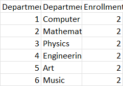

# University Database Analysis Project

## Table of Contents

- [University Database Analysis Project](#university-database-analysis-project)
  - [Table of Contents](#table-of-contents)
  - [Overview](#overview)
  - [Tasks](#tasks)
- [Database Creation or Restoration](#database-creation-or-restoration)
- [**Data Analysis**](#data-analysis)
- [**Query Operations (Breakdown, Rollup, Cube)**](#query-operations-breakdown-rollup-cube)
- [**Result Reports with Charts or Graphs**](#result-reports-with-charts-or-graphs)

## Overview
* This project evaluates your proficiency in SQL, database creation, restoration, data analysis, and result reporting.
* You have the flexibility to choose any database for analysis.
* Examples and tasks are based on a hypothetical database named "UniversityDB."

## Tasks

# Database Creation or Restoration
  * Create a new database or restore an existing one.
  * Insert dummy data into it.

# **Data Analysis**
  * Write SQL queries to answer:
    - Count of students by department
      ```sql
      --a.Count of Students by Department:
      SELECT d.DepartmentName, COUNT(s.StudentID) AS StudentCount
      FROM department d
      JOIN student s ON s.DepartmentID = d.DepartmentID
      GROUP BY d.DepartmentName;
      ```

      
    - **Total enrollment by year**
      ```sql
      --b. Total Enrollment by Year:
      SELECT AcademicYear, COUNT(DISTINCT EnrollmentID) AS total_enrollment
      FROM enrollment
      GROUP BY AcademicYear;
      ```

      
    - **Average GPA by course**
      ```sql
      --c. Average GPA by Course:
      SELECT CourseID, AVG(GPA) AS Average_Gpa
      FROM enrollment
      GROUP BY CourseID;
      ```
      

# **Query Operations (Breakdown, Rollup, Cube)**
  * Write SQL queries to perform breakdown, rollup, and cube operations.

    - **Breakdown of enrollment by department**
      ```sql
      USE UniversityDB;
      SELECT
        d.DepartmentID,
        d.DepartmentName,
        COUNT(e.EnrollmentID) AS EnrollmentCount
      FROM
        department d
        LEFT JOIN
          student s ON d.DepartmentID = s.DepartmentID
        LEFT JOIN
          enrollment e ON s.StudentID = e.StudentID
      GROUP BY
        d.DepartmentID, d.DepartmentName;
      ```
         
    
      
    - **Rollup of enrollment by year and department**
      ```sql
      USE UniversityDB;
      SELECT 
        e.AcademicYear, 
        d.DepartmentName, 
        COUNT(DISTINCT e.StudentID) AS EnrollmentCount
      FROM enrollment e
      JOIN student s ON e.StudentID = s.StudentID
      JOIN department d ON s.DepartmentID = d.DepartmentID
      GROUP BY e.AcademicYear, d.DepartmentName
      ORDER BY e.AcademicYear, d.DepartmentName;
      ```
         
     - **Cube of enrollment by course, year, and department**
        ```sql
        USE UniversityDB;
        SELECT 
            c.CourseID, 
            CourseName, 
            AcademicYear, 
            d.DepartmentID, 
            DepartmentName,
            COUNT(DISTINCT EnrollmentID) AS EnrollmentCount
        FROM enrollment e
        JOIN student s ON e.StudentID = s.StudentID
        JOIN department d ON s.DepartmentID = d.DepartmentID
        JOIN course c ON e.CourseID = c.CourseID
        GROUP BY c.CourseID, CourseName, AcademicYear, d.DepartmentID, DepartmentName;
        ```
         
# **Result Reports with Charts or Graphs**
  * Power BI Visualization

    Utilizing the magic of Power BI, we've seamlessly connected our database to create an immersive experience of our data. The Visuals directory houses a captivating dataVisualization.pbix file, a treasure trove of multiple graphs and diagrams. These visuals not only bring our data to life but also enhance its analytical depth. Dive into the world of insights as each graph unfolds a unique perspective, making your data exploration not just informative but visually engaging. Unleash the power of visualization with a simple click on our Power BI project, and let the data tell its story! 📊✨
